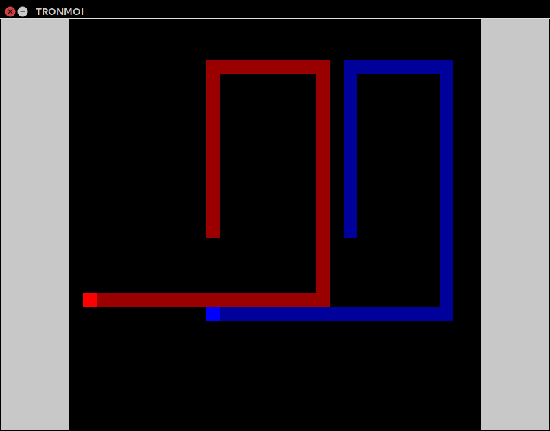

# Tronmoi

[Ver en Español](README_ES.md)



Tronmoi is a Tron clone for two players (no machine player). It was made back in 2009, and by the end of 2014, I decided to refine it and release it as a demo (v0.1.0)

## Current status

**Inactive**. A playable demo (DEB package) can be downloaded (from here)[https://github.com/moisesjbc/tronmoi/releases].

## Building (Only tested on Ubuntu 14.04)

1. Install dependencies

 ```
 sudo apt-get install libsdl-ttf2.0-dev libsdl1.2-dev fonts-liberation
 ```

2. Clone this repository locally

 ```
 git clone git@github.com:moisesjbc/tronmoi.git 
 ```

3. Open project file with [qtcreator](http://qt-project.org/wiki/Category:Tools::QtCreator)

 ```
 qtcreator tronmoi/project/tronmoi.pro
 ```

4. Build and enjoy!
